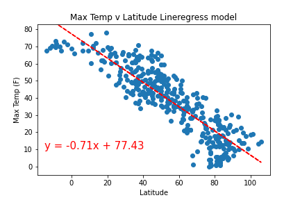

# API_challenge -- 
In this example, i'll be creating a Python script to visualize the weather of 500+ cities across the world of varying distance from the equator. To accomplish this, i'll be utilizing a simple Python library, the OpenWeatherMap API, and a little common sense to create a representative model of weather across world cities.
The first requirement is to create a series of scatter plots to showcase the following relationships:

Temperature (F) vs. Latitude  
Humidity (%) vs. Latitude  
Cloudiness (%) vs. Latitude  
Wind Speed (mph) vs. Latitude  

I then ran linear regression on each relationship. This time, i will separate the plots into Northern Hemisphere (greater than or equal to 0 degrees latitude) and Southern Hemisphere (less than 0 degrees latitude):

Northern Hemisphere - Temperature (F) vs. Latitude  
Southern Hemisphere - Temperature (F) vs. Latitude  
Northern Hemisphere - Humidity (%) vs. Latitude  
Southern Hemisphere - Humidity (%) vs. Latitude  
Northern Hemisphere - Cloudiness (%) vs. Latitude  
Southern Hemisphere - Cloudiness (%) vs. Latitude  
Northern Hemisphere - Wind Speed (mph) vs. Latitude  
Southern Hemisphere - Wind Speed (mph) vs. Latitude  

  

Randomly select at least 500 unique (non-repeat) cities based on latitude and longitude.
Perform a weather check on each of the cities using a series of successive API calls.
Include a print log of each city as it's being processed with the city number and city name.
Save a CSV of all retrieved data and a PNG image for each scatter plot.

Part II - VacationPy
Now let's use our skills in working with weather data to plan future vacations. Use jupyter-gmaps and the Google Places API for this part of the assignment.

Create a heat map that displays the humidity for every city from Part I.

